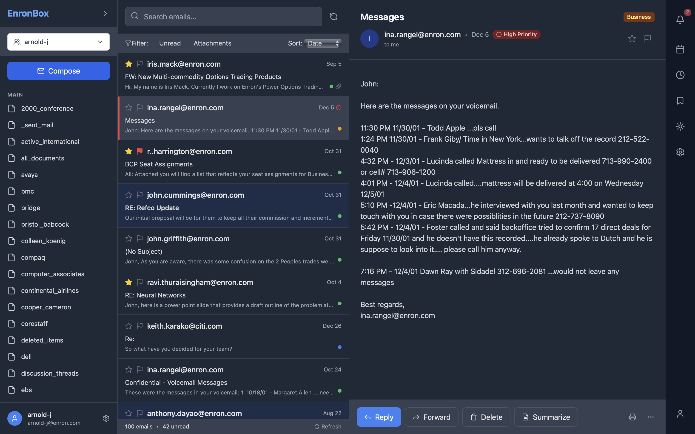
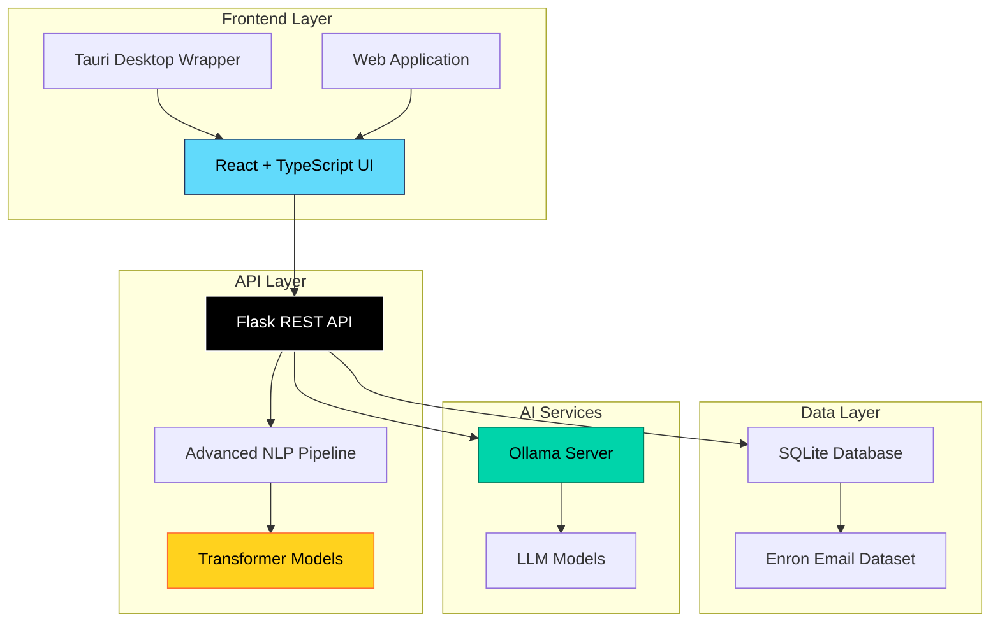

<div align="center">

# 📬 EnronClassifier

[](https://reactjs.org/)
[](https://flask.palletsprojects.com/)
[](https://tauri.app/)
[](https://www.docker.com/)
[](https://huggingface.co/transformers/)
[](https://www.typescriptlang.org/)


### 🚀 Advanced Email Intelligence Platform

**Transform email analysis with AI-powered classification, summarization, and emotion detection**

<p align="center">
  <a href="#-quick-start"><kbd> <br> 🚀 Quick Start <br> </kbd></a>&nbsp;&nbsp;
  <a href="#-features"><kbd> <br> ✨ Features <br> </kbd></a>&nbsp;&nbsp;
  <a href="#-architecture"><kbd> <br> 🏗️ Architecture <br> </kbd></a>&nbsp;&nbsp;
  <a href="#-development"><kbd> <br> 💻 Development <br> </kbd></a>
</p>

</div>

> **🎯 Built for researchers, data scientists, and NLP enthusiasts** — Leverage cutting-edge transformer models and advanced NLP techniques to unlock insights from the Enron email dataset with GPU-accelerated performance.

---

## 🌟 What is EnronClassifier?

**EnronClassifier** is a sophisticated email analysis platform that combines the power of modern transformer models with an intuitive cross-platform interface. Whether you're conducting research, analyzing communication patterns, or exploring NLP techniques, our application provides comprehensive tools for email classification, summarization, and emotion analysis.

<div align="center">
  
</div>

---

## ✨ Key Features

<table>
<tr>
<td width="50%">

### 🧠 **Intelligent Classification**
- **10 comprehensive categories** for precise email sorting
- **Zero-shot classification** using BART transformer
- **Semantic understanding** with sentence transformers
- **Multi-label support** for complex emails

</td>
<td width="50%">

### 📄 **Smart Summarization** 
- **Extractive summarization** using NLTK, spaCy, Sumy
- **Key phrase extraction** for quick insights
- **Configurable length** based on your needs
- **Context preservation** for accurate summaries

</td>
</tr>
<tr>
<td width="50%">

### 🎭 **Emotion Analysis**
- **Sentiment detection** with confidence scores
- **Tone analysis** for communication insights  
- **Enhancement suggestions** for better phrasing
- **Emotional context** understanding

</td>
<td width="50%">

### 🤖 **AI Response Generation**
- **Ollama integration** for intelligent replies
- **Context-aware responses** based on email content
- **Multiple LLM options** (Llama, CodeLlama, etc.)
- **Customizable tone** and style

</td>
</tr>
<tr>
<td width="50%">

### ⚡ **Performance Optimized**
- **GPU acceleration** with full CUDA support
- **Apple Silicon (MPS)** compatibility
- **Intelligent fallback** to CPU when needed
- **Efficient caching** for faster processing

</td>
<td width="50%">

### 💻 **Cross-Platform**
- **Desktop app** via Tauri framework
- **Web interface** for browser-based usage
- **Docker support** for easy deployment
- **Unix & Windows** compatibility

</td>
</tr>
</table>

---

## 🏷️ Classification System

Our advanced classification system categorizes emails into **10 distinct categories** using state-of-the-art transformer models:

<div align="center">

| 🎯 Category | 📝 Description | 🔍 Examples |
|-------------|---------------|-------------|
| **🎯 Strategic Planning** | Long-term strategy, acquisitions, corporate planning | "Q4 merger discussion", "5-year growth plan" |
| **⚙️ Daily Operations** | Routine tasks, operational procedures | "Daily status update", "Process changes" |
| **💰 Financial** | Budget, accounting, expense reports | "Monthly P&L", "Budget approval" |
| **⚖️ Legal & Compliance** | Legal matters, regulatory compliance | "Contract review", "Compliance audit" |
| **🤝 Client & External** | External communications, partnerships | "Client meeting", "Vendor negotiation" |
| **👥 HR & Personnel** | Human resources, hiring matters | "New hire onboarding", "Performance review" |
| **🗓️ Meetings & Events** | Scheduling, event planning | "Board meeting agenda", "Conference planning" |
| **🚨 Urgent & Critical** | Time-sensitive, emergency issues | "System outage", "Urgent approval needed" |
| **💬 Personal & Informal** | Personal communications, informal chats | "Lunch plans", "Weekend discussion" |
| **🔧 Technical & IT** | Technical support, system issues | "Server maintenance", "Software bug report" |

</div>

---

## 🚀 Quick Start Guide

### 📋 Prerequisites

<div align="center">

| 🛠️ Tool | 📌 Version | 📝 Notes |
|---------|------------|----------|
| **Node.js & npm** | `v18+` | [Download here](https://nodejs.org/) |
| **Docker** | `Latest` | [Get Docker](https://www.docker.com/products/docker-desktop/) |
| **Rust** | `Latest` | Required for Tauri builds |
| **Python** | `3.10+` | For local Flask development |
| **Ollama** | `Latest` | [Install Ollama](https://ollama.com) for AI features |

</div>

### 🎯 One-Command Setup

<table>
<tr>
<td width="50%" align="center">

### 🐧 **Unix Systems**
*Linux, macOS, WSL*

```bash
# Complete setup in one command
./bin/enron_classifier.sh
```

**That's it!** ✨ The script handles everything:
- 📥 Downloads Enron dataset
- 🗄️ Builds SQLite database  
- 🎨 Installs frontend dependencies
- 🚀 Starts Flask API
- 💻 Launches desktop app

</td>
<td width="50%" align="center">

### 🪟 **Windows**
*Docker-based setup*

```bash
# 1. Download dataset
./bin/download_enron.cmd

# 2. Generate database
./bin/generate_db.cmd

# 3. Start services
docker compose up --build

# 4. Launch desktop app
npm --prefix ./apps/enron_classifier run tauri dev
```

</td>
</tr>
</table>

### 🤖 AI Setup (Optional)

Enable intelligent email response generation:

```bash
# Install Ollama from https://ollama.com

# Choose your preferred model
ollama pull llama3.2:3b        # 🏃‍♂️ Fast & lightweight
ollama pull llama3.1:8b        # ⚖️ Balanced performance  
ollama pull codellama:7b       # 💻 Technical emails

# Verify installation
ollama list
```

---

## 🏗️ Architecture Overview

<div align="center">



</div>

### 🔧 Technology Stack

<div align="center">

| Layer | Technologies | Purpose |
|-------|-------------|---------|
| **🎨 Frontend** | React 18, TypeScript, Tailwind CSS, Framer Motion | Modern, responsive user interface |
| **🖥️ Desktop** | Tauri, Rust | Cross-platform desktop application |
| **🔗 API** | Flask 3.1, Python 3.10+ | RESTful backend services |
| **🧠 ML/NLP** | Transformers, BART, DistilBERT, NLTK, spaCy | Advanced language processing |
| **🗄️ Database** | SQLite | Efficient email data storage |
| **🤖 AI** | Ollama, Llama models | Intelligent response generation |

</div>

---

## 🛠️ Development Setup

### 📁 Project Structure

```
NLP_project/
├── 📱 apps/
│   ├── 🐍 flask_api/              # Backend API
│   │   ├── app/
│   │   │   ├── 🛣️ routes/         # API endpoints
│   │   │   ├── 🔧 services/       # ML/NLP services
│   │   │   │   ├── 🧠 enron_classifier.py
│   │   │   │   ├── 🎭 emotion_enhancer.py
│   │   │   │   ├── 📄 summarizer.py
│   │   │   │   ├── 🤖 responder.py
│   │   │   │   └── 🏷️ ner_engine.py
│   │   │   └── 🧪 tests/
│   │   └── 📊 models/
│   ├── ⚛️ enron_classifier/       # Frontend React app
│   │   ├── src/
│   │   │   ├── 🧩 components/
│   │   │   ├── 🔄 contexts/
│   │   │   ├── 🪝 hooks/
│   │   │   └── 📱 pages/
│   │   └── 🦀 src-tauri/         # Tauri config
│   └── 🗄️ SQLite_db/             # Database generation
├── 📜 bin/                       # Setup scripts
├── 🐳 docker-compose.yml
└── 📖 README.md
```

### 🚀 Development Commands

<div align="center">

| Command | Description | Platform |
|---------|-------------|----------|
| `./bin/enron_classifier.sh` | 🎯 Complete setup | Unix |
| `./bin/enron_classifier.sh --api-only` | 🔧 API development | Unix |
| `./bin/enron_classifier.sh --frontend-only` | 🎨 Frontend development | Unix |
| `docker compose up --build` | 🐳 Docker development | All |
| `npm run tauri dev` | 🖥️ Desktop app development | All |
| `npm run dev` | 🌐 Web app development | All |

</div>

### 🔗 API Endpoints

<div align="center">

| 🛣️ Endpoint | 📝 Method | 🎯 Purpose | 📊 Input |
|-------------|-----------|-----------|----------|
| `/classify` | `POST` | Email classification | Email text |
| `/summarize` | `POST` | Text summarization | Email content |
| `/emotion-enhance` | `POST` | Emotion analysis | Email text |
| `/respond` | `POST` | AI response generation | Email context |
| `/users` | `GET` | List Enron users | None |
| `/users/<id>/emails` | `GET` | User's emails | User ID |

</div>

---

## ⚡ Performance & Optimization

### 🎯 Hardware Acceleration

<div align="center">

| 🖥️ Platform | 🚀 Acceleration | 📈 Performance | 🛠️ Setup Command |
|-------------|----------------|----------------|------------------|
| **🐧 Linux + NVIDIA** | Full CUDA | ⭐⭐⭐⭐⭐ Excellent | `./bin/enron_classifier.sh` |
| **🪟 Windows + NVIDIA** | Full CUDA | ⭐⭐⭐⭐⭐ Excellent | Docker setup |
| **🍎 macOS (Apple Silicon)** | Limited MPS | ⭐⭐⭐⭐ Good | `./bin/enron_classifier.sh` |
| **🍎 macOS (Intel)** | CPU only | ⭐⭐⭐ Good | `./bin/enron_classifier.sh` |
| **🐧 WSL** | CPU/CUDA | ⭐⭐⭐⭐ Good | `./bin/enron_classifier.sh` |

</div>

### 💡 Performance Tips

- **🚀 GPU Acceleration**: Use NVIDIA GPUs for best performance
- **🍎 Apple Silicon**: Native setup recommended over Docker
- **💾 Memory**: 8GB+ RAM recommended for large datasets
- **🔄 Caching**: Models are cached after first load

---

## 🛠️ Troubleshooting

<details>
<summary><b>🔧 Common Issues & Solutions</b></summary>

### 🐧 Unix Setup Issues
```bash
# Make script executable
chmod +x ./bin/enron_classifier.sh

# Run with debug output
bash -x ./bin/enron_classifier.sh
```

### 🐳 Docker Issues
```bash
# Reset Docker environment  
docker compose down --volumes
docker compose up --build --force-recreate
```

### 🤖 Ollama Connection Issues
```bash
# Check Ollama status
ollama list
curl http://localhost:11434/api/tags

# Restart Ollama service
ollama serve
```

### 📦 Node.js Issues
```bash
# Clear and reinstall dependencies
npm cache clean --force
rm -rf node_modules package-lock.json
npm install
```

</details>

---

## 🤝 Contributing

<div align="center">

### 🌟 We welcome contributions!

[](CONTRIBUTING.md)

</div>

**How to contribute:**

1. 🍴 **Fork** the repository
2. 🌿 **Create** your feature branch (`git checkout -b feature/amazing-feature`)
3. ✨ **Commit** your changes (`git commit -m 'Add amazing feature'`)
4. 🚀 **Push** to the branch (`git push origin feature/amazing-feature`)
5. 🎯 **Open** a Pull Request

**Contribution areas:**
- 🧠 ML model improvements
- 🎨 UI/UX enhancements  
- 📚 Documentation updates
- 🧪 Test coverage expansion
- 🐛 Bug fixes

---

## 👥 Team

<div align="center">

| Role | Focus | Expertise |
|------|-------|-----------|
| **🚀 Lead Developer** | Architecture & Integration | Full-stack, ML Pipeline |
| **🧠 ML Engineer** | NLP & AI Models | Transformers, GPU Optimization |
| **🎨 Frontend Developer** | UI/UX & React | TypeScript, Modern Web |
| **🐍 Backend Developer** | API & Services | Flask, Python, Databases |
| **📊 Data Scientist** | Analytics & Insights | Statistics, Visualization |

</div>

---

## 📜 License

<div align="center">

[](https://opensource.org/licenses/MIT)

This project is licensed under the **MIT License** - see the [LICENSE](LICENSE.md) file for details.

</div>

---

## 🙏 Acknowledgments

<div align="center">

**Built with ❤️ and powered by:**

[](https://huggingface.co/)
[](https://ollama.com/)
[](https://www.cs.cmu.edu/~enron/)

*Special thanks to the open-source community and research institutions that make advanced NLP accessible to everyone.*

</div>

---

<div align="center">

### 🎉 Ready to revolutionize email analysis?

<a href="#-quick-start"><kbd> <br> 🚀 Get Started Now <br> </kbd></a>

**📧 Transform emails into insights with AI! 📧**

</div>